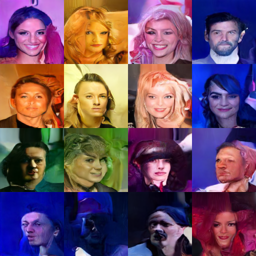
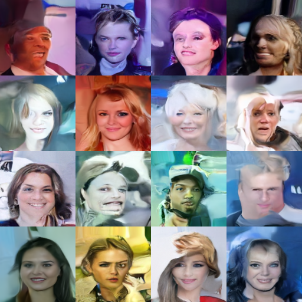
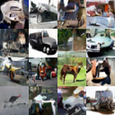
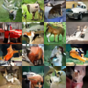
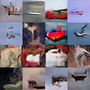
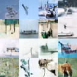
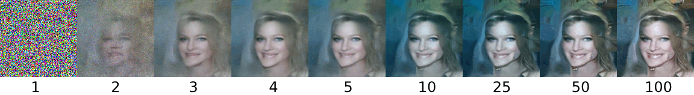
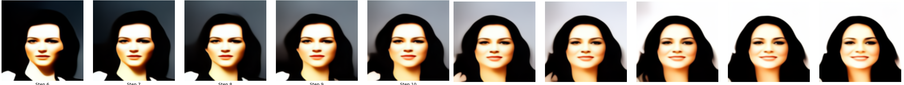

# Diffusion Models

This repository contains the code and results for our term project in the **UMC203: Introduction to AI and ML** course at **IISc**.

## 📌 Contributors
- [Om Prakash Choudhary](https://github.com/Om2005Prakash)  
- [Himesh Kumar Anant](https://github.com/himeshanant)  
- [Jithendra Rao Kasibhatla](https://github.com/jithendra085)
- [Keval Pithadiya](https://github.com/kevalpithadiya)

---

## 🧪 Results
For a detailed explanation of the methodology, training setup, and results, check out the full report:  
📄 [Read the Report (PDF)](./Project%20Report.pdf)

### CelebA 128x128 – Noise Prediction

<table>
  <tr>
    <td>
      <figure>
        
        <figcaption align="center">DDPM – Noise Prediction</figcaption>
      </figure>
    </td>
    <td>
      <figure>
        
        <figcaption align="center">DDIM – Noise Prediction</figcaption>
      </figure>
    </td>
  </tr>
</table>

---

### CIFAR-10 32x32

<table>
  <tr>
    <td>
      <figure>
        
        <figcaption align="center">DDPM – Noise Prediction</figcaption>
      </figure>
    </td>
    <td>
      <figure>
        
        <figcaption align="center">DDIM – Noise Prediction</figcaption>
      </figure>
    </td>
  </tr>
  <tr>
    <td>
      <figure>
        
        <figcaption align="center">DDPM – Clean Image Prediction</figcaption>
      </figure>
    </td>
    <td>
      <figure>
        
        <figcaption align="center">Score Matching</figcaption>
      </figure>
    </td>
  </tr>
</table>

---

### Miscellaneous

<table>
  <tr>
    <td>
      <figure>
        
        <figcaption align="center">Sample Quality vs Sampling Steps</figcaption>
      </figure>
    </td>
  </tr>
  <tr>
    <td>
      <figure>
        
        <figcaption align="center">Latent Interpolation (CelebA 128x128)</figcaption>
      </figure>
    </td>
  </tr>
</table>


---

## 🧠 Models Trained

We trained **Denoising Diffusion Probabilistic Models (DDPMs)** using Hugging Face's `diffusers` library for both noise prediction and clean image prediction objectives.

### 📊 Datasets and Resolutions
- **CIFAR-10**: 32×32  
- **CelebA**: 32×32 and 128×128  
- **MNIST**: 32×32  

### 🔗 Pretrained Models
- 📁 [Google Drive Folder](https://drive.google.com/drive/folders/1HmLK4hkkI6-Fl6vaHyX05PBe8U2FWl5E?usp=drive_link)  
- 🤗 [HuggingFace Model Hub](https://huggingface.co/Om2005Prakash/Diffusion_Pre_Trained/tree/main)

---

## 🛠️ Setup Instructions

## Requirements
HuggingFace `diffusers` Library
```sh
pip install diffusers[training]
```
Python Version Used: 3.13.2
